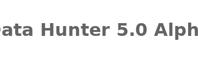

<p align="center">
  
</p>

<h1 align="center">🔎       Data Hunter 5.0 Alpha</h1>
<p align="center">
Busca Inteligente e Análise Automatizada de Datasets Públicos.<br>
</p>

<p align="center">
  <a href="https://streamlit.io/">
    
  </a>
  <a href="https://www.python.org/">
    
  </a>
</p>

---

# 📦 Funcionalidades
- 🔍 Busca fontes confiáveis (.gov, .edu, Kaggle)
- 🛡️ Validação semântica dos links
- 💾 Download robusto
- 📊 Análise automática
- 📈 Ranking interativo
- 📥 Download zipado dos datasets encontrados

---

# 🚀 Como Rodar Localmente

```bash
pip install -r requirements.txt
streamlit run app.py
```

---

# 🌎 Deploy Online

Streamlit Community Cloud

---

# 📚 Tecnologias

- Python 3.10+
- Streamlit
- BeautifulSoup4
- DuckDuckGo Search
- Plotly
