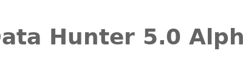

<p align="center">
  
</p>

<h1 align="center">Data Hunter <sub><sup>v6.9</sup></sub></h1>

<p align="center">
  <strong>Converse com um assistente de IA, descreva o que precisa, e receba datasets prontos para uso.</strong><br/>
  Expansão de query com IA · Busca multi-fonte · Download paralelo · Scoring de relevância semântica
</p>

<p align="center">
  
  
  
  
  
  
  
  
</p>

---

## O que é

Data Hunter é uma aplicação Streamlit que **automatiza a descoberta e avaliação de datasets públicos**. Em vez de garimpar manualmente dezenas de portais, você descreve o tema em linguagem natural — o app refina sua intenção via chat, expande a query com IA, busca em quatro fontes simultaneamente, baixa os arquivos em paralelo e entrega um ranking por relevância semântica.

```
Você: "preciso de dados de emissores eletromagnéticos"
App:  pergunta de refinamento → extrai keywords técnicas →
      busca em Web + Kaggle + Zenodo + Hugging Face →
      baixa, analisa e ranqueia por relevância semântica
```

---

## Fontes suportadas

| Fonte | O que busca | Autenticação |
|---|---|---|
| 🌐 **Web (DuckDuckGo)** | Portais regulatórios (.gov, .edu, FCC, ANATEL, ITU), dados abertos | Não necessária |
| 🏆 **Kaggle** | Datasets públicos com metadata rica (downloads, votos, licença) | `KAGGLE_USERNAME` + `KAGGLE_KEY` |
| 🤗 **Hugging Face** | Datasets da comunidade de ML/IA | Opcional (`HF_TOKEN`) |
| 🔬 **Zenodo** | Datasets científicos e de pesquisa (CERN Open Data) | Opcional (`ZENODO_TOKEN`) |

---

## Pipeline

```
1. Chat com assistente IA (Groq llama-3.3-70b)
   └─ Refinamento por perguntas → extração de keywords

2. Expansão de query (Groq llama-3.3-70b)
   └─ Gera 6+ variantes técnicas em EN/PT com vocabulário do domínio
      (ex: EMI, EIRP, radiated emissions, spectrum monitoring...)

3. Busca em paralelo nas 4 fontes
   └─ Crawling paralelo de páginas com captura de contexto (título, meta)
   └─ Links diretos para arquivos de dados priorizados

4. Download paralelo (ThreadPoolExecutor)
   └─ httpx com streaming · retry automático · limite de 80 MB por arquivo

5. Análise paralela por dataset
   ├─ Score de qualidade: completude, tamanho, % de nulos
   ├─ Score de relevância token: sobreposição query ↔ colunas
   ├─ Score de relevância IA: avaliação semântica via Groq (0–100)
   └─ Threshold de corte: descarta datasets com relevância < 20

6. Ranking e entrega
   └─ Cards com scores · gráfico comparativo · download ZIP
```

---

## Funcionalidades

- **Interface conversacional** — chat com histórico, geração de título de sessão, Enter para enviar
- **Expansão de query inteligente** — vocabulário técnico do domínio injetado automaticamente no prompt (EMC, EMI, EIRP, espectro RF, DATASUS, INMET, NOAA...)
- **Progresso ao vivo** — 4 contadores em tempo real (variantes, páginas, arquivos, datasets) + etapas expansíveis com sub-detalhes
- **Contexto de página** — título e meta description de cada página são passados ao scorer de relevância
- **Formatos científicos** — suporte a CSV, Excel, JSON, ZIP, Parquet, HDF5 (h5py), NetCDF (xarray)
- **Histórico de buscas** — SQLite local com restauração de sessões anteriores
- **Golden dataset** — suite de avaliação de recall com queries de referência para domínios técnicos
- **CI/CD** — GitHub Actions com matrix Python 3.10/3.11/3.12

---

## Como rodar

### 1. Clone o repositório

```bash
git clone https://github.com/mfidosjr/DataHunter.git
cd DataHunter
```

### 2. Instale as dependências

```bash
pip install -r requirements.txt
```

### 3. Configure as variáveis de ambiente

Crie um arquivo `.env` na raiz:

```env
# Groq — expansão de query + scoring semântico + chat (gratuito em console.groq.com)
GROQ_API_KEY="sua_chave_groq"

# Kaggle — kaggle.com > Settings > API > Create New Token
KAGGLE_USERNAME="seu_usuario"
KAGGLE_KEY="sua_chave_kaggle"

# Hugging Face — opcional, só para datasets privados
HF_TOKEN=""

# Zenodo — opcional, aumenta rate limit
ZENODO_TOKEN=""
```

> Sem as chaves, o app funciona: busca web e Zenodo permanecem ativas, e o scoring semântico cai para modo por keywords.

### 4. Rode

```bash
streamlit run app.py
```

Acesse em **http://localhost:8501**

---

## Avaliar a qualidade de busca (golden dataset)

O projeto inclui uma suite de avaliação com queries de referência e fontes esperadas para domínios técnicos (emissores EM, espectro RF, EMC, clima, saúde):

```bash
# Avalia todas as queries de referência
python tests/golden/evaluate.py

# Avalia apenas a query de emissores eletromagnéticos
python tests/golden/evaluate.py --id eme_01

# Aumenta o K para avaliar mais resultados
python tests/golden/evaluate.py --id eme_01 --k 30
```

O avaliador mede três dimensões por query:
- **Cobertura de vocabulário** — % dos termos técnicos esperados que apareceram nas variantes geradas
- **Recall de fontes** — % das fontes esperadas (FCC, ANATEL, ITU...) encontradas nos resultados
- **Datasets conhecidos** — checklist ✓/✗ para cada dataset de referência

---

## Arquitetura

```
app.py                    # UI Streamlit — orquestra o pipeline completo
├── query_expander.py     # Expansão de query via Groq + vocabulário de domínio
├── search.py             # Busca DuckDuckGo com priorização de fontes regulatórias
├── validation.py         # Crawling paralelo com captura de contexto de página
├── downloader.py         # Download streaming com retry (tenacity + httpx)
├── kaggle_source.py      # Conector Kaggle (busca + download)
├── huggingface_source.py # Conector Hugging Face (busca + download)
├── zenodo_source.py      # Conector Zenodo (busca + download com filtro de tamanho)
├── analyzer.py           # Scores de qualidade + relevância token + relevância IA
├── semantic_analyzer.py  # Descrição semântica das colunas (Groq ou keywords)
├── history.py            # Histórico de buscas em SQLite
└── tests/
    ├── test_*.py         # Testes unitários (pytest)
    └── golden/
        ├── queries.json  # Queries de referência com fontes e datasets esperados
        └── evaluate.py   # Avaliador de recall para domínios técnicos
```

---

## Deploy no Streamlit Cloud

1. Faça fork deste repositório
2. No [Streamlit Community Cloud](https://streamlit.io/cloud), crie um novo app apontando para `app.py`
3. Em **Settings > Secrets**, adicione as variáveis do `.env`
4. Deploy

---

## Tecnologias

- [Python 3.10+](https://www.python.org/) · [Streamlit 1.37+](https://streamlit.io/)
- [Groq](https://groq.com/) — llama-3.3-70b-versatile (chat e expansão) · llama-3.1-8b-instant (scoring rápido)
- [Kaggle API](https://github.com/Kaggle/kaggle-api) · [Hugging Face Hub](https://huggingface.co/docs/huggingface_hub) · [Zenodo REST API](https://developers.zenodo.org/)
- [ddgs](https://github.com/deedy5/ddgs) · [httpx](https://www.python-httpx.org/) · [tenacity](https://tenacity.readthedocs.io/)
- [BeautifulSoup4](https://beautiful-soup-4.readthedocs.io/) · [Pandas](https://pandas.pydata.org/) · [Plotly](https://plotly.com/python/)
- [h5py](https://www.h5py.org/) · [xarray](https://xarray.pydata.org/) · [pytest](https://pytest.org/)

---

<p align="center">
  Feito com 🔎 para quem vive de dados
</p>
