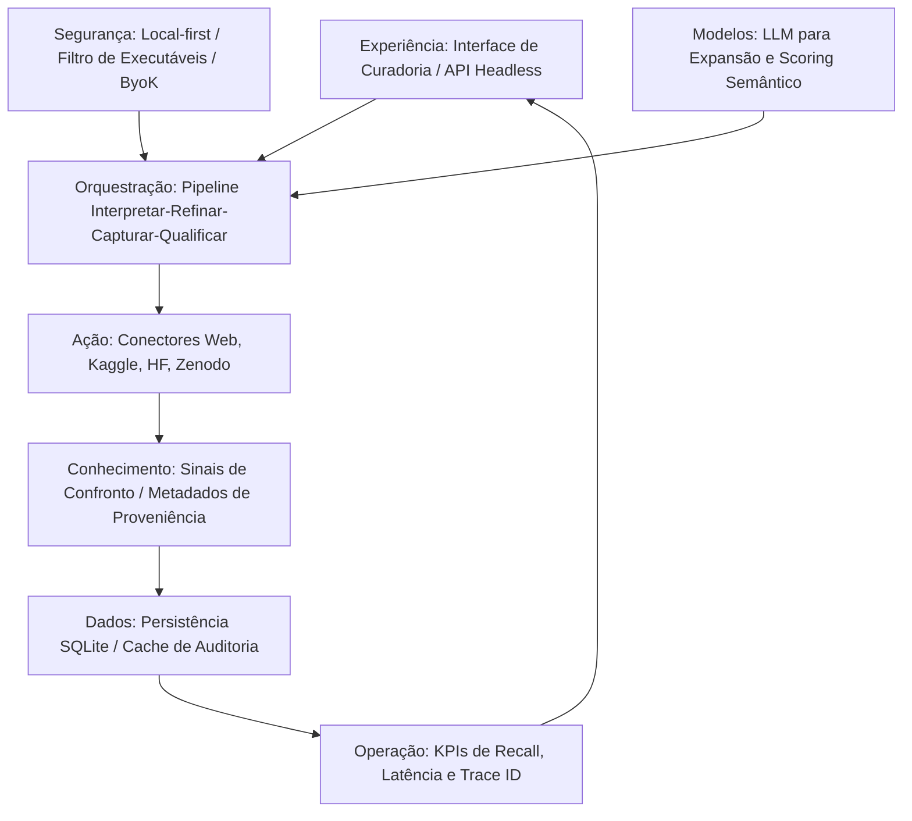

<p align="center">
  
</p>

# DataHunter <sub><sup>v1.0</sup></sub>

> *"Você não busca dados. Você caça evidências técnicas."*

**DataHunter** é uma camada agêntica de descoberta e curadoria de dados técnicos, estruturada para preencher a lacuna entre a intenção de conhecimento e a localização de fontes de alta autoridade. Ele automatiza o ciclo de vida da pesquisa técnica, transformando buscas manuais em um pipeline governado, rastreável e qualificado por IA.

O sistema opera sob o modelo de quatro verbos: **Interpretar · Refinar · Capturar · Qualificar**.

Consulte o [CONOPS v1.0](docs/01-produto/CONOPS.md) para a baseline institucional do conceito de operação.

---

## Sumário

- [Visão Geral](#visão-geral)
- [O Problema](#o-problema)
- [A Proposta (Pipeline Agêntico)](#a-proposta-pipeline-agêntico)
- [Arquitetura de Referência em 8 Camadas](#arquitetura-de-referência-em-8-camadas)
- [Fontes de Alta Autoridade](#fontes-de-alta-autoridade)
- [Integração com o Ecossistema (PKGL)](#integração-com-o-ecossistema-pkgl)
- [Guia de Início Rápido](#guia-de-início-rápido)
- [Mapa de Documentação](#mapa-de-documentação)
- [Direções de Evolução (Roadmap)](#direções-de-evolução-roadmap)

---

## Visão Geral

O DataHunter não é um motor de busca genérico. Ele é um orquestrador de descoberta técnica que utiliza LLMs para expandir semânticamente uma demanda, consultar múltiplos silos de dados simultaneamente (Web, Kaggle, Hugging Face, Zenodo) e aplicar um scoring de autoridade e relevância baseado em evidências.

---

## O Problema

A descoberta de datasets técnicos e evidências regulatórias sofre com:
*   **Dispersão**: Dados estão espalhados em portais .gov, .edu e repositórios comunitários.
*   **Ruído**: Motores de busca priorizam popularidade (SEO) sobre autoridade técnica.
*   **Alucinação**: IAs generativas sozinhas muitas vezes inventam links ou fontes inexistentes.
*   **Falta de Proveniência**: É difícil rastrear a origem exata e o licenciamento de um achado.

---

## A Proposta (Pipeline Agêntico)

### Interpretar & Refinar
O sistema usa um chat agêntico para sanar ambiguidades e expandir a query inicial em dezenas de variantes técnicas em múltiplos idiomas, garantindo cobertura total do domínio.

### Capturar
Executa buscas paralelas massivas em repositórios científicos e portais de dados abertos, validando a existência de cada link via protocolos de inspeção prévia.

### Qualificar
Aplica um modelo de scoring em três dimensões:
1.  **Autoridade da Fonte**: Peso para domínios oficiais e acadêmicos.
2.  **Relevância Semântica**: Comparação entre metadados técnicos e a intenção de busca original.
3.  **Fidelidade Técnica**: Validação de esquemas e formatos de arquivos.

---

## Arquitetura de Referência em 8 Camadas

O DataHunter segue o padrão **AIT Standard**, garantindo que cada funcionalidade esteja posicionada em uma camada de governança clara.


```mermaid
graph TD
    EXP[Experiência: Interface de Curadoria / API Headless] --> ORQ
    SEG[Segurança: Local-first / Filtro de Executáveis / ByoK] --> ORQ
    ORQ[Orquestração: Pipeline Interpretar-Refinar-Capturar-Qualificar] --> ACA
    ACA[Ação: Conectores Web, Kaggle, HF, Zenodo] --> CON
    CON[Conhecimento: Sinais de Confronto / Metadados de Proveniência] --> DAT
    MOD[Modelos: LLM para Expansão e Scoring Semântico] --> ORQ
    DAT[Dados: Persistência SQLite / Cache de Auditoria] --> OPE
    OPE[Operação: KPIs de Recall, Latência e Trace ID] --> EXP
```

---

## Fontes de Alta Autoridade

| Fonte | Tipo | Foco |
| --- | --- | --- |
| 🌐 **Web Aberta** | Regulatórios | Portais .gov, .edu, FCC, ANATEL, ITU. |
| 🏆 **Kaggle** | Data Science | Datasets estruturados com metadados de comunidade. |
| 🤗 **Hugging Face** | AI/ML | Modelos e bases de dados para treinamento de IA. |
| 🔬 **Zenodo** | Científico | Repositórios de pesquisa e dados acadêmicos (CERN). |

---

## Integração com o Ecossistema (PKGL)

O DataHunter é o principal provedor de **Sinais de Confronto** para o [PKGL (Personal Knowledge Governance Layer)](https://github.com/1-AI-DECISION-LAB/PKGL-personal-knowledge-governance-layer). Ele alimenta o grafo de conhecimento com evidências externas, permitindo que o PKGL detecte contradições ou valide aprendizados internos contra fontes globais de autoridade.

---

## Guia de Início Rápido

### 1. Requisitos
*   Python 3.10+
*   Chaves de API para os provedores de inferência e fontes técnicas (detalhado em [ARQUITETURA-BASELINE](docs/03-arquitetura/ARQUITETURA-BASELINE.md)).

### 2. Instalação
```bash
git clone https://github.com/AI-DECISION-LAB/DataHunter.git
cd DataHunter
pip install -r requirements.txt
```

### 3. Configuração
Crie um arquivo `.env` com suas credenciais:
```env
GROQ_API_KEY="sua_chave"
KAGGLE_USERNAME="seu_user"
KAGGLE_KEY="sua_chave"
```

### 4. Execução
```bash
streamlit run app.py
```

---

## Mapa de Documentação

| Camada | Documentos | Finalidade |
| --- | --- | --- |
| **01-Produto** | [CONOPS](docs/01-produto/CONOPS.md) | Visão, Conceito Operacional e Roadmap. |
| **02-Requisitos** | [SRS](docs/02-requisitos/SRS.md) | Requisitos funcionais e técnicos. |
| **03-Arquitetura** | [BASELINE](docs/03-arquitetura/ARQUITETURA-BASELINE.md) | Stack tecnológica e decisões de design. |
| **11-Backlog** | [ROADMAP](docs/11-backlog/ROADMAP.md) | Fases de evolução e marcos técnicos. |
| **12-Riscos** | [RISCOS.md](docs/12-riscos/RISCOS.md) | Matriz de riscos e mitigação. |

---

## Direções de Evolução (Roadmap)

*   **Fase 1 (Atual)**: Baseline Operacional via Web/Kaggle e interface de curadoria.
*   **Fase 2**: Lançamento do **DataHunter MCP Server** para integração com IDEs (Cursor/VSCode).
*   **Fase 3**: Implementação de **Deep Scoring** (inspeção interna de colunas e estatísticas).
*   **Fase 4**: Integração plena de Sinais de Confronto com o Grafo PKGL.

---

<p align="center">
  Feito com 🔎 pela <strong>AI Decision Lab</strong> para quem governa conhecimento.
</p>
